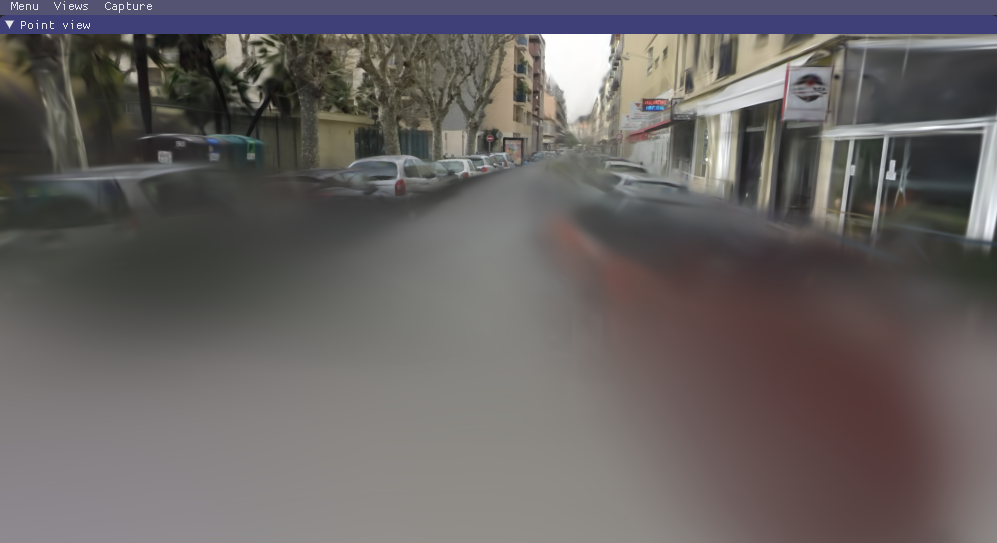
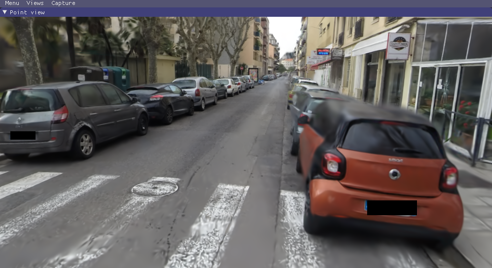

# 3D Gaussian Splatting for Real-Time Radiance Field Rendering

Bernhard Kerbl*, Georgios Kopanas*, Thomas Leimkühler, George Drettakis (* indicates equal contribution)

| [Webpage](https://repo-sam.inria.fr/fungraph/3d-gaussian-splatting/) | [Full Paper](https://repo-sam.inria.fr/fungraph/3d-gaussian-splatting/3d_gaussian_splatting_high.pdf) | [Video](https://youtu.be/T_kXY43VZnk) | [Other GRAPHDECO Publications](http://www-sop.inria.fr/reves/publis/gdindex.php) | [FUNGRAPH project page](https://fungraph.inria.fr) |
|---|---|---|---|---|
| [T&T+DB COLMAP (650MB)](https://repo-sam.inria.fr/fungraph/3d-gaussian-splatting/datasets/input/tandt_db.zip) | [Pre-trained Models (14 GB)](https://repo-sam.inria.fr/fungraph/3d-gaussian-splatting/datasets/pretrained/models.zip) | [Viewers for Windows (60MB)](https://repo-sam.inria.fr/fungraph/3d-gaussian-splatting/binaries/viewers.zip) | [Evaluation Images (7 GB)](https://repo-sam.inria.fr/fungraph/3d-gaussian-splatting/evaluation/images.zip) |


This repository contains the official authors' implementation associated with the paper "3D Gaussian Splatting for Real-Time Radiance Field Rendering". We further provide the reference images used to create the error metrics reported in the paper, as well as recently created, pre-trained models.

<a href="https://www.inria.fr/"></a>
<a href="https://univ-cotedazur.eu/"></a>
<a href="https://www.mpi-inf.mpg.de"></a>
<a href="https://team.inria.fr/graphdeco/"></a>

## Table of Contents

- [How it Works](#how-it-works)
- [Project Structure](#project-structure)
- [Cloning the Repository](#cloning-the-repository)
- [Setup](#setup)
  - [Optimizer Setup](#optimizer-setup)
  - [Viewer Setup](#viewer-setup)
- [Running the Optimizer](#running-the-optimizer)
- [Evaluation](#evaluation)
- [Interactive Viewers](#interactive-viewers)
- [Processing your own Scenes](#processing-your-own-scenes)
- [FAQ](#faq)
- [Acknowledgements](#acknowledgements)
- [BibTeX](#bibtex)

## How it Works

Radiance Field methods have recently revolutionized novel-view synthesis of scenes captured with multiple photos or videos. However, achieving high visual quality still requires neural networks that are costly to train and render, while recent faster methods inevitably trade off speed for quality. For unbounded and complete scenes (rather than isolated objects) and 1080p resolution rendering, no current method can achieve real-time display rates.

This project introduces three key elements to achieve state-of-the-art visual quality while maintaining competitive training times and allowing high-quality real-time (≥ 30 fps) novel-view synthesis at 1080p resolution:

1.  **3D Gaussian Representation:** Starting from sparse points produced during camera calibration, the scene is represented with 3D Gaussians. This representation preserves the desirable properties of continuous volumetric radiance fields for scene optimization while avoiding unnecessary computation in empty space.
2.  **Interleaved Optimization and Density Control:** The 3D Gaussians are optimized with interleaved optimization and density control. This includes optimizing anisotropic covariance to achieve an accurate representation of the scene.
3.  **Fast Visibility-Aware Rendering:** A fast, visibility-aware rendering algorithm is used, which supports anisotropic splatting. This both accelerates training and allows for real-time rendering.

## Project Structure

The repository is organized as follows:

```
├── assets/
├── gaussian_renderer/
├── scene/
├── utils/
├── SIBR_viewers/
├── submodules/
│   ├── diff-gaussian-rasterization/
│   └── simple-knn/
├── train.py
├── render.py
├── metrics.py
├── full_eval.py
├── convert.py
└── environment.yml
```

-   `assets/`: Contains images and logos used in the `README.md` file.
-   `gaussian_renderer/`: Contains the core differentiable Gaussian rasterizer.
-   `scene/`: Contains code for representing the 3D scene, including the Gaussian model and camera information.
-   `utils/`: Contains utility functions for various tasks, such as system operations, image processing, and loss calculations.
-   `SIBR_viewers/`: Contains the source code for the interactive viewers, based on the SIBR framework.
-   `submodules/`: Contains the submodules for the differentiable Gaussian rasterization and k-NN search.
-   `train.py`: The main script for training the 3D Gaussian Splatting model.
-   `render.py`: The script for rendering images from a trained model.
-   `metrics.py`: The script for computing evaluation metrics (L1, PSNR, SSIM) on the rendered images.
-   `full_eval.py`: A script for running the full evaluation pipeline (training, rendering, and metrics).
-   `convert.py`: A script for converting your own images into the required COLMAP format.
-   `environment.yml`: The Conda environment file for setting up the required dependencies.

## Cloning the Repository

The repository contains submodules, so please clone it recursively:

```shell
# SSH
git clone git@github.com:graphdeco-inria/gaussian-splatting.git --recursive
```

or

```shell
# HTTPS
git clone https://github.com/graphdeco-inria/gaussian-splatting --recursive
```

## Setup

The project has two main components with different setup requirements: the PyTorch-based optimizer and the C++/CUDA-based viewers.

### Optimizer Setup

The optimizer is used to train the 3D Gaussian Splatting models.

#### Hardware Requirements

-   CUDA-ready GPU with Compute Capability 7.0+
-   24 GB of VRAM (for training to the quality reported in the paper)

#### Software Requirements

-   Conda
-   C++ Compiler (Visual Studio 2019 on Windows)
-   CUDA SDK 11 (we used 11.8; known issues with 11.6)

#### Installation

We recommend using Conda to set up the environment:

```shell
# On Windows, you might need to set this environment variable
SET DISTUTILS_USE_SDK=1

# Create and activate the conda environment
conda env create --file environment.yml
conda activate gaussian_splatting
```

The `environment.yml` file contains the following dependencies:

```yaml
name: gaussian_splatting
channels:
  - pytorch
  - conda-forge
  - defaults
dependencies:
  - cudatoolkit=11.6
  - plyfile
  - python=3.7.13
  - pip=22.3.1
  - pytorch=1.12.1
  - torchaudio=0.12.1
  - torchvision=0.13.1
  - tqdm
  - pip:
    - submodules/diff-gaussian-rasterization
    - submodules/simple-knn
```

### Viewer Setup

The viewers are used to visualize the training process and render the trained models in real-time.

#### Hardware Requirements

-   OpenGL 4.5-ready GPU
-   4 GB of VRAM (recommended)
-   CUDA-ready GPU with Compute Capability 7.0+ (for the real-time viewer)

#### Software Requirements

-   C++ Compiler (Visual Studio 2019 on Windows, g++ on Linux)
-   CUDA SDK 11 (we used 11.8)
-   CMake (we used 3.24)
-   7zip (Windows only)

#### Pre-built Binaries for Windows

We provide pre-built binaries for Windows, which you can download from [here](https://repo-sam.inria.fr/fungraph/3d-gaussian-splatting/binaries/viewers.zip). This is the recommended way to get the viewers on Windows.

#### Building from Source

If you want to build the viewers from source, you can find the source code in the `SIBR_viewers` directory.

**Windows:**

```shell
cd SIBR_viewers
cmake -Bbuild .
cmake --build build --target install --config RelWithDebInfo
```

**Ubuntu 22.04:**

```shell
# Install dependencies
sudo apt install -y libglew-dev libassimp-dev libboost-all-dev libgtk-3-dev libopencv-dev libglfw3-dev libavdevice-dev libavcodec-dev libeigen3-dev libxxf86vm-dev libembree-dev

# Build the project
cd SIBR_viewers
cmake -Bbuild . -DCMAKE_BUILD_TYPE=Release
cmake --build build -j24 --target install
```

## Running the Optimizer

To run the optimizer, use the `train.py` script:

```shell
python train.py -s <path_to_colmap_or_nerf_synthetic_dataset>
```

<details>
<summary><span style="font-weight: bold;">Command Line Arguments for train.py</span></summary>

  #### --source_path / -s
  Path to the source directory containing a COLMAP or Synthetic NeRF data set.
  #### --model_path / -m 
  Path where the trained model should be stored (```output/<random>``` by default).
  #### --images / -i
  Alternative subdirectory for COLMAP images (```images``` by default).
  #### --eval
  Add this flag to use a MipNeRF360-style training/test split for evaluation.
  #### --resolution / -r
  Specifies resolution of the loaded images before training. If provided ```1, 2, 4``` or ```8```, uses original, 1/2, 1/4 or 1/8 resolution, respectively. For all other values, rescales the width to the given number while maintaining image aspect. **If not set and input image width exceeds 1.6K pixels, inputs are automatically rescaled to this target.**
  #### --data_device
  Specifies where to put the source image data, ```cuda``` by default, recommended to use ```cpu``` if training on large/high-resolution dataset, will reduce VRAM consumption, but slightly slow down training. Thanks to [HrsPythonix](https://github.com/HrsPythonix).
  #### --white_background / -w
  Add this flag to use white background instead of black (default), e.g., for evaluation of NeRF Synthetic dataset.
  #### --sh_degree
  Order of spherical harmonics to be used (no larger than 3). ```3``` by default.
  #### --convert_SHs_python
  Flag to make pipeline compute forward and backward of SHs with PyTorch instead of ours.
  #### --convert_cov3D_python
  Flag to make pipeline compute forward and backward of the 3D covariance with PyTorch instead of ours.
  #### --debug
  Enables debug mode if you experience erros. If the rasterizer fails, a ```dump``` file is created that you may forward to us in an issue so we can take a look.
  #### --debug_from
  Debugging is **slow**. You may specify an iteration (starting from 0) after which the above debugging becomes active.
  #### --iterations
  Number of total iterations to train for, ```30_000``` by default.
  #### --ip
  IP to start GUI server on, ```127.0.0.1``` by default.
  #### --port 
  Port to use for GUI server, ```6009``` by default.
  #### --test_iterations
  Space-separated iterations at which the training script computes L1 and PSNR over test set, ```7000 30000``` by default.
  #### --save_iterations
  Space-separated iterations at which the training script saves the Gaussian model, ```7000 30000 <iterations>``` by default.
  #### --checkpoint_iterations
  Space-separated iterations at which to store a checkpoint for continuing later, saved in the model directory.
  #### --start_checkpoint
  Path to a saved checkpoint to continue training from.
  #### --quiet 
  Flag to omit any text written to standard out pipe. 
  #### --feature_lr
  Spherical harmonics features learning rate, ```0.0025``` by default.
  #### --opacity_lr
  Opacity learning rate, ```0.05``` by default.
  #### --scaling_lr
  Scaling learning rate, ```0.005``` by default.
  #### --rotation_lr
  Rotation learning rate, ```0.001``` by default.
  #### --position_lr_max_steps
  Number of steps (from 0) where position learning rate goes from ```initial``` to ```final```. ```30_000``` by default.
  #### --position_lr_init
  Initial 3D position learning rate, ```0.00016``` by default.
  #### --position_lr_final
  Final 3D position learning rate, ```0.0000016``` by default.
  #### --position_lr_delay_mult
  Position learning rate multiplier (cf. Plenoxels), ```0.01``` by default. 
  #### --densify_from_iter
  Iteration where densification starts, ```500``` by default. 
  #### --densify_until_iter
  Iteration where densification stops, ```15_000``` by default.
  #### --densify_grad_threshold
  Limit that decides if points should be densified based on 2D position gradient, ```0.0002``` by default.
  #### --densification_interval
  How frequently to densify, ```100``` (every 100 iterations) by default.
  #### --opacity_reset_interval
  How frequently to reset opacity, ```3_000``` by default. 
  #### --lambda_dssim
  Influence of SSIM on total loss from 0 to 1, ```0.2``` by default. 
  #### --percent_dense
  Percentage of scene extent (0--1) a point must exceed to be forcibly densified, ```0.01``` by default.

</details>

## Evaluation

To evaluate a trained model, you can use the `render.py` and `metrics.py` scripts:

```shell
# Render the test set
python render.py -m <path_to_trained_model>

# Compute metrics
python metrics.py -m <path_to_trained_model>
```

We also provide a `full_eval.py` script to run the complete evaluation pipeline.

<details>
<summary><span style="font-weight: bold;">Command Line Arguments for full_eval.py</span></summary>

  #### --skip_training
  Flag to skip training stage.
  #### --skip_rendering
  Flag to skip rendering stage.
  #### --skip_metrics
  Flag to skip metrics calculation stage.
  #### --output_path
  Directory to put renderings and results in, ```./eval``` by default, set to pre-trained model location if evaluating them.
  #### --mipnerf360 / -m360
  Path to MipNeRF360 source datasets, required if training or rendering.
  #### --tanksandtemples / -tat
  Path to Tanks&Temples source datasets, required if training or rendering.
  #### --deepblending / -db
  Path to Deep Blending source datasets, required if training or rendering.
</details>

<details>
<summary><span style="font-weight: bold;">Command Line Arguments for render.py</span></summary>

  #### --model_path / -m 
  Path to the trained model directory you want to create renderings for.
  #### --skip_train
  Flag to skip rendering the training set.
  #### --skip_test
  Flag to skip rendering the test set.
  #### --quiet 
  Flag to omit any text written to standard out pipe. 

  **The below parameters will be read automatically from the model path, based on what was used for training. However, you may override them by providing them explicitly on the command line.** 

  #### --source_path / -s
  Path to the source directory containing a COLMAP or Synthetic NeRF data set.
  #### --images / -i
  Alternative subdirectory for COLMAP images (```images``` by default).
  #### --eval
  Add this flag to use a MipNeRF360-style training/test split for evaluation.
  #### --resolution / -r
  Changes the resolution of the loaded images before training. If provided ```1, 2, 4``` or ```8```, uses original, 1/2, 1/4 or 1/8 resolution, respectively. For all other values, rescales the width to the given number while maintaining image aspect. ```1``` by default.
  #### --white_background / -w
  Add this flag to use white background instead of black (default), e.g., for evaluation of NeRF Synthetic dataset.
  #### --convert_SHs_python
  Flag to make pipeline render with computed SHs from PyTorch instead of ours.
  #### --convert_cov3D_python
  Flag to make pipeline render with computed 3D covariance from PyTorch instead of ours.

</details>

<details>
<summary><span style="font-weight: bold;">Command Line Arguments for metrics.py</span></summary>

  #### --model_paths / -m 
  Space-separated list of model paths for which metrics should be computed.
</details>

## Interactive Viewers

We provide two interactive viewers:

-   **Network Viewer:** Connects to a running training process and visualizes the optimization in real-time.
-   **Real-time Viewer:** Renders a trained model in real-time.

To run the viewers, execute the corresponding applications from the `install/bin` directory inside `SIBR_viewers`.

## Processing your own Scenes

You can process your own images to create a dataset suitable for training. You will need to have COLMAP and ImageMagick installed.

1.  Place your images in a directory `<location>/input`.
2.  Run the `convert.py` script:

```shell
python convert.py -s <location>
```

This will create a COLMAP dataset in the required format.

<details>
<summary><span style="font-weight: bold;">Command Line Arguments for convert.py</span></summary>

  #### --no_gpu
  Flag to avoid using GPU in COLMAP.
  #### --skip_matching
  Flag to indicate that COLMAP info is available for images.
  #### --source_path / -s
  Location of the inputs.
  #### --camera 
  Which camera model to use for the early matching steps, ```OPENCV``` by default.
  #### --resize
  Flag for creating resized versions of input images.
  #### --colmap_executable
  Path to the COLMAP executable (```.bat``` on Windows).
  #### --magick_executable
  Path to the ImageMagick executable.
</details>

## FAQ
- *Where do I get data sets, e.g., those referenced in ```full_eval.py```?* The MipNeRF360 data set is provided by the authors of the original paper on the project site. Note that two of the data sets cannot be openly shared and require you to consult the authors directly. For Tanks&Temples and Deep Blending, please use the download links provided at the top of the page. Alternatively, you may access the cloned data (status: August 2023!) from [HuggingFace](https://huggingface.co/camenduru/gaussian-splatting)


- *How can I use this for a much larger dataset, like a city district?* The current method was not designed for these, but given enough memory, it should work out. However, the approach can struggle in multi-scale detail scenes (extreme close-ups, mixed with far-away shots). This is usually the case in, e.g., driving data sets (cars close up, buildings far away). For such scenes, you can lower the ```--position_lr_init```, ```--position_lr_final``` and ```--scaling_lr``` (x0.3, x0.1, ...). The more extensive the scene, the lower these values should be. Below, we use default learning rates (left) and ```--position_lr_init 0.000016 --scaling_lr 0.001"``` (right).

|  <!-- --> | <!-- -->  |
| --- | --- |

- *I'm on Windows and I can't manage to build the submodules, what do I do?* Consider following the steps in the excellent video tutorial [here](https://www.youtube.com/watch?v=UXtuigy_wYc), hopefully they should help. The order in which the steps are done is important! Alternatively, consider using the linked Colab template.

- *It still doesn't work. It says something about ```cl.exe```. What do I do?* User Henry Pearce found a workaround. You can you try adding the visual studio path to your environment variables (your version number might differ);
```C:\Program Files (x86)\Microsoft Visual Studio\2019\Community\VC\Tools\MSVC\14.29.30133\bin\Hostx64\x64```
Then make sure you start a new conda prompt and cd to your repo location and try this;
```
conda activate gaussian_splatting
cd <dir_to_repo>/gaussian-splatting
pip install submodules\diff-gaussian-rasterization
pip install submodules\simple-knn
```

- *I'm on macOS/Puppy Linux/Greenhat and I can't manage to build, what do I do?* Sorry, we can't provide support for platforms outside of the ones we list in this README. Consider using the linked Colab template.

- *I don't have 24 GB of VRAM for training, what do I do?* The VRAM consumption is determined by the number of points that are being optimized, which increases over time. If you only want to train to 7k iterations, you will need significantly less. To do the full training routine and avoid running out of memory, you can increase the ```--densify_grad_threshold```, ```--densification_interval``` or reduce the value of ```--densify_until_iter```. Note however that this will affect the quality of the result. Also try setting ```--test_iterations``` to ```-1``` to avoid memory spikes during testing. If ```--densify_grad_threshold``` is very high, no densification should occur and training should complete if the scene itself loads successfully.

- *24 GB of VRAM for reference quality training is still a lot! Can't we do it with less?* Yes, most likely. By our calculations it should be possible with **way** less memory (~8GB). If we can find the time we will try to achieve this. If some PyTorch veteran out there wants to tackle this, we look forward to your pull request!


- *How can I use the differentiable Gaussian rasterizer for my own project?* Easy, it is included in this repo as a submodule ```diff-gaussian-rasterization```. Feel free to check out and install the package. It's not really documented, but using it from the Python side is very straightforward (cf. ```gaussian_renderer/__init__.py```).

- *Wait, but ```<insert feature>``` isn't optimized and could be much better?* There are several parts we didn't even have time to think about improving (yet). The performance you get with this prototype is probably a rather slow baseline for what is physically possible.

- *Something is broken, how did this happen?* We tried hard to provide a solid and comprehensible basis to make use of the paper's method. We have refactored the code quite a bit, but we have limited capacity to test all possible usage scenarios. Thus, if part of the website, the code or the performance is lacking, please create an issue. If we find the time, we will do our best to address it.

## Acknowledgements

This research was funded by the ERC Advanced grant FUNGRAPH No 788065. The authors are grateful to Adobe for generous donations, the OPAL infrastructure from Université Côte d’Azur and for the HPC resources from GENCI–IDRIS (Grant 2022-AD011013409). The authors thank the anonymous reviewers for their valuable feedback, P. Hedman and A. Tewari for proofreading earlier drafts also T. Müller, A. Yu and S. Fridovich-Keil for helping with the comparisons.

## BibTeX

```bibtex
@Article{kerbl3Dgaussians,
      author       = {Kerbl, Bernhard and Kopanas, Georgios and Leimk{\"u}hler, Thomas and Drettakis, George},
      title        = {3D Gaussian Splatting for Real-Time Radiance Field Rendering},
      journal      = {ACM Transactions on Graphics},
      number       = {4},
      volume       = {42},
      month        = {July},
      year         = {2023},
      url          = {https://repo-sam.inria.fr/fungraph/3d-gaussian-splatting/}
}
```
